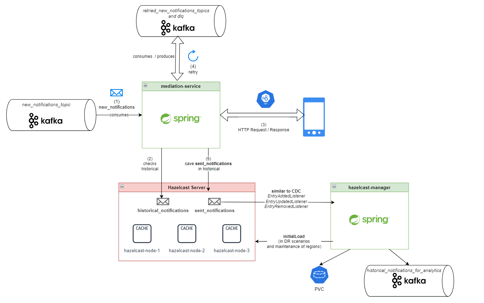

# mediation-service

- [Introduction](#Introduction)
- [DataFlow_Assessment](#DataFlow_Assessment)
- [Design](#Design)
- [Modelling](#Modelling)
- [Flow](#Flow)
    - [HTTPClient](#HTTPClient)
- [Implementation](#Implementation)
    - [StateBaseAsyncDoFn](#StateBaseAsyncDoFn)
    - [HTTPClient](#HTTPClient)
        - [AkkaHttpClient](#AkkaHttpClient)
    - [ZIORetry](#ZIORetry)
- [Testing](#Testing)
    - [StateAsyncParDoWithHttpHandler](#StateAsyncParDoWithHttpHandler)
- [StressTests](#StressTests)
- [Background](#Background)

- Medium Post: TBD

## Introduction

We must migrate an on premise microservice (mediation-service) application that:

- is implemented in Spring (living in Openshift).
- reads: records from Kafka.
- output: HTTP Requests to a notification hub endpoint.
- keeps state (historical results) in a In Memory Data Grid (IMDG) Hazelcast cluster (living in Openshift).
- scales horizontally increasing its number of PODs.

> NOTE: we do not have a Hazelcast Enterprise cluster due to extra cost avoidance. Thus, on top of the Hazelcast
> cluster we need an extra "storage logic layer", as PVC in Kuberentes or as decoupled topic layer in Kafka to
> repopullate
> the state, when a disaster recovery or mainteance restart in new regions come about. This is managed by an additional
> hazelcast-manager microservice.

Could this design be simplified when migrating into GCP? could we use a distributed Big Data processing engine like
Dataflow to undertake massive Async HTTP Requests? what about keeping the state of this sent Http Requests to avoid
duplicates?
Let's move on to the next section.

## DataFlow_Assessment

Duplicated data in the "distributed/BigData" world is a reality, especially if your pipeline is using Kafka at some
stage (rebalancing still coming about), reprocessing old transactions by mistake from your origin (e.g: with a
ChangeDataCapture from DB2), failed ACK in a microservice when publishing into Pubsub, and so on. Sometimes it is okay
to deal with them, but your pupils can get into proper autofocus mode after some
duplicated DEBIT or BILLS push notifications that are just popping up on your smartphone's screen, not cool at all…

At some point in your pipeline you must drop the duplicated processed data or prevent them from being sent at least, but
what about if you have sent millions of notifications already? In addition, you need to face a high throughput of pushes
to be delivered (end of the month bills, black friday, holidays, etc) and low latency to be resolved before being sent…
SOLUTION? You need to keep the state externally or maybe internally…???

Internally you can easily face issues, such as out of memory headaches and keeping the state in distributed nodes, all
can be challenging. Vertical scalability is actually available in Dataflow Prime, but let's explore other options.

Externally you have some databases widely used in the distributed world like Cassandra, HBase (Bigtable), Cache (Redis,
Memorystore), In Memory Data Grid (IMDG Hazelcast), etc… Each of them have different pros and cons (not the purpose of
this post), but the main drawback on the cloud is, I am sure you can guess: COST. Furthermore, if you need to deploy
Regional or Multi-Regional instances this cost will proportionally increase.

Some of you may be familiar with mapWithState in
SparkStreaming (https://www.databricks.com/blog/2016/02/01/faster-stateful-stream-processing-in-apache-spark-streaming.html),
keeping the state of elements among windows. Apache Beam has also a really cool and more powerful
pattern https://beam.apache.org/blog/timely-processing/ called State and
Timer (S & T) widely used in the industry and with some interesting underlying infrastructure when using the Dataflow
runner. I would
encourage you to go through some of the Beam Summit talks in the last section to figure it out.

This looks like a good fit... but:

- how would it be possible using a S & T through an Async ParDo? how would we attach a HTTP Client? how would it scale?
- how can we achieve this using SCIO Scala for Apache Beam?
- would this be cheaper than managing infrastructure, replicas, reloading historical notifications after a new node is
  up or shutdown? which limitations are we facing with streaming, windowing and S & T when asynchronous HTTP calls are
  involved?

If you want to figure some of these questions out, you are in the right place.

## Design

- based on KV State & Timer (S & T) pattern: https://beam.apache.org/blog/timely-processing/
- Why SCIO? https://cloud.google.com/blog/products/data-analytics/developing-beam-pipelines-using-scala
  Leveraging https://spotify.github.io/scio/releases/migrations/v0.8.0Migration-Guide.html#async-dofns attaching a HTTPS
  client for reaching an endpoint (e.g: https://jsonplaceholder.typicode.com/guide/) and sending _MyEventRecord_, also
  known as _BusinessEventRecord_ (BER, if you come across this acronym, sorry, this is an open source adaptation of a
  real-world productive Dataflow application).
- applying State (as _idempotent_key_ in BagState) and Timer, avoiding duplicates with same _idempotent_key_ as long as
  the
  Timer is not flushed (acting as TTL).

## Modelling

1. Using Avro (as new/historical
   notifications): [MyEventRecord](avro/MyEventRecord.java)
2. HTTPResponse and HTTPRequest: [notification.model](notification/model)
3. _idempotent_key_: [MyEventRecordUtils](avro/MyEventRecordUtils.scala)

```
  def getIdempotentNotificationKey(record: MyEventRecord) = s"${record.getEvent.getTransactionId}-${record.getCustomer.getId}"
```

## Flow

This diagram represents the ingestion and processing flow of the BER notifications, from ingestion to delivery to the
HTTP endpoint through its state management within the S & T:


1. Reading **historical_notifications** from Google Cloud Storage (GCS) as OPTION 1. OPTION 2, from Pubsub, alternative
   one (to be implemented)
2. Ingestion and pre S & T Flow. Notifications (BERs) are Globally windowed and keyed by _idempotent_key_
    - 2.1: Reading **new_notifications** from Pubsub.
    - 2.2: Treating **historical_notifications**, _SideInput approach is taken_ (as long as TTL is applied) for
      discarding duplicates from **new_notifications** against **historical_notifications**.
    - 2.3: KO _inValidBers_ method as toxic notifications in GCS.

> NOTE 1: make sure you can fit in all **historical_notifications** from GCS as SideInput in your workers, allocating
> enough memory

> NOTE 2: A unionAll with Bounded "historical" (GCS) and Unbounded "fresh" (Pubsub), has been discarded, as it stalls
> the
> process (only first
> emitted Pane from Pubsub is emitted) despite GroupByKey
(GBK) when applying state (for State And Timer), and using GlobalWindow (other Triggers were included but only first
> Pane Pubsub records were shown). As mentioned in point 1, potential OPTION 2, might be useful when reloading
**historical_notifications** into Pubsub and
> then loading them into the State and Timer, thus, all new notifications and historical will be wrapped seemingly as
> "unbounded", applying S & T for **historical_notifications**.

3. applyKVState to Flush Futures. Saving attempted notifications BERs (new_notifications) in KV as State and release
   them when Timer expires (TTL): avoiding duplicates (race conditions are mitigated as _distinctByKey_ is previously
   applied)
4. Checks if the **new_notifications** have been already processed and keeps state by idempotent key, add Future
    - 4.1: processElement (ParDo) in _StateBaseAsyncDoFn.java_.
    - 4.2: _StateAsyncParDoWithHttpHandler.scala_: sending HTTP request.
    - 4.3: flush() in _StateBaseAsyncDoFn.java_: Future [Http Response] is asynchronous and _StateBaseAsyncDoFn.java_
      will deal with it (outputting to main routine).
5. Output HTTP Response is emitted in the main routine.
6. Now you can save your HTTP Response/NOTIFICATION_RESPONSE along with the "sent" **new_notification** in Pubsub (e.g:
   sinking in GCS eventually, useful for analytics as external table
   alongside the historical load as
   *historical_notifications* if mediation-service is restarted).

## Implementation
### StateBaseAsyncDoFn

This class [StateBaseAsyncDoFn](http/state/StateBaseAsyncDoFn.java) is mainly based on the implementation of SCIO's
_BaseAsyncDoFn_ https://github.com/spotify/scio/blob/main/scio-core/src/main/java/com/spotify/scio/transforms/BaseAsyncDoFn.java
but abstracting out some methods, adding a Timer(TTL) along with a BagState (buffer). All of these are needed to use the
S & T pattern, preventing duplicated HTTP Requests from being sent:

```
    public void processElement(
            @Element InputT element,
            @TimerId("ttl") Timer ttl,
            @StateId("buffer") BagState<InputT> buffer,
            @Timestamp Instant timestamp,
            OutputReceiver<OutputT> out,
            BoundedWindow window) {
        flush(out);
        settingElementTTLTimer(buffer, ttl, element); // abstract
        initialLoad(buffer, element, ttl); // abstract

        if (!alreadySentOrLoaded(buffer, element, ttl)) // abstract
            try {
                final UUID uuid = UUID.randomUUID();
                addIdempotentElementInBuffer(buffer, element);// abstract, WATCH OUT: potential race conditions
                final FutureT future = processElement(element);
                futures.put(uuid, handleOutput(future, element, buffer, uuid, timestamp, window));
            } catch (Exception e) {
                LOG.error("Failed to process element", e);
                throw e;
            }
        else
            outputAlreadySentOrLoaded(element, out); // abstract
    }
```

Thus, the notifications can be loaded in the "State" as initialLoad or if they have not been sent.
The Time To Live(TTL) can be set up as desired in the implementations or in _settingElementTTLTimer_.

An implementation of this class is shown
here: [StateAsyncParDoWithHttpHandler](http/StateAsyncParDoWithHttpHandler.scala).

It must be stated, that SCIO provides some options to deal with similar "caching" scenarios, please refer
to: https://spotify.github.io/scio/releases/migrations/v0.8.0-Migration-Guide.html#async-dofns, as _BaseAsyncLookupDoFn_
has a type parameter for some cache implementation, plugging in whatever cache supplier you want, e.g. a
com.google.common.cache.Cache, having it for handling TTL. Although, a concern here would be the scalability, therefore,
Dataflow Vertical autoscaling feature might come into place, tackling ingestion peaks.

This SCIO caching capability along with a workaround for adding something similar to
this [StateAsyncParDoWithHttpHandler](#StateAsyncParDoWithHttpHandler) using a S & T pattern, has been discussed as a
potential future enhancement here: https://github.com/spotify/scio/issues/5055.

### HTTPClient

"Bring your own HTTP Client", like akka or zio here: [clients](http/clients). Implement it
as [AbstractHttpClient](http/clients/AbstractHttpClient.scala) and you can include it as **httpClient**:
```
lazy val httpClient = {
  mediationConfig.mediation.httpClientType match {
    case "akka" => new AkkaHttpClient
    case "zio"  => new ZioHttpClient
    case "yourHttpClient"  => new YourHttpClient
  }
}
```

within the [StateAsyncParDoWithHttpHandler](http/StateAsyncParDoWithHttpHandler.scala)

#### AkkaHttpClient

Information to implement an Akka HTTP Client can be
found https://doc.akka.io/docs/akka-http/current/client-side/index.html

This is the current implementation: [AkkaHttpClient](http/clients/akka/AkkaHttpClient.scala)

### ZIORetry

Some retry mechanism has been implemented using ZIO retry for Scala: https://zio.dev/reference/schedule/retrying/, so
that we can avoid Dead Letter Queuing or Retry topic patterns. Retry is achieved at process level as shown below:

```
  def sendPushWithRetryZio(
    record: InputBer
  )(implicit zioRuntime: Runtime[Any]): StateAndTimerType.FutureKVOutputBerAndHttpResponse = {
    import zio._
    lazy val futureRetriableBer = ZIO
      .attempt {
        getResource.sendPushWithFutureResponse(newEventRecordWithRetryIncrement(record))
      }
      .retry(Schedule.fixed(BACKOFF_SECONDS.second) && Schedule.recurs(MAX_RETRIES))
      .onError(cause =>
        ZIO.succeed(
          log.error(s"[exhausted_notification=${record.getEvent.getTransactionId}] Retried error:${cause}", cause)
        )
      )

    Unsafe.unsafe { implicit unsafe =>
      zioRuntime.unsafe.run(futureRetriableBer).getOrThrowFiberFailure()
    }
  }
```

## Testing

### StateAsyncParDoWithHttpHandler

- Understanding the main purpose and design of the State and Timer pattern, keeping the idempotent state for
  _MyEventRecord_ notifications, before sending them as _MyHttpRequest_, just run in
  Intellij: [MediationServiceSpec_1_OK_2_DUPLICATES](../../../../../.run/MediationServiceSpec.1 OK and 2 SENT_OR_DUPLICATED HTTP_RESPONSE should exist in the same stream.run.xml)

> _HINT 1_: it uses the DirectRunner in your local machine (do not worry about not having a GCP project).

> _HINT 2_: Pubsub emulator in Java needs this
> workaround https://cloud.google.com/Pubsub/docs/emulator#Pubsub-emulator-java. I have not got it sorted (yet). In the
> meantime we can just get by with TestStream.

### StressTests

Some "Stress testing" has been undertaken with Mock data sets (with different _idempotent_key_), peaking more than +200K
notifications / min with the current AkkaHttpClient config, forcing the application to scale up and keeping
approximately a million
of
notifications saved as "ttl" State:

```
    akka {
      max-open-requests = 20000
      max-open-connection = 20000
      initial-timeout = 30
      completion-timeout = 60
      buffer = 20000
      throttle-requests = 1000
      throttle-per-second = 1
      throttle-burst = 1000
    }
```

Bearing in mind that the same Mock data sets have been used in all scenarios, it is worth noting (with all e2 family GCE
machine type):

- e2-highmem-4: scaling was needed (maxWorkers=3 was set up).
- e2-standard-4: we got good balance between scalability, latency and cost. Scaling was not needed (we got a bit of
  backlog delay, but bearable from the business perspective).
- e2-highcpu-4: we got some OutOfMemory issues (restarting a worker), it did handle the load but with the worst
  performance.

## Conclusions

A similar application
to https://github.com/albertols/scio-db/blob/cleanup-for-medium/src/main/scala/com.db.myproject/mediation/MediationService.scala
has successfully been deployed on Dataflow in a real-world productive end to end pipeline and replaced:
- A Spring microservice (on Openshift) that was reading notifications from Kafka and sending them to a HTTP endpoint.
- An entire multi-node Hazelcast cluster (on Openshift) that was acting as low latency IMDG storage later for
historical/sent notifications.
- An additional hazelcast-manager microservice (on Openshift) that was managing an extra "storage logic layer" for the sent
notifications (realtime) and mantaining historical (in a Kuberentes PVC or Kafka topics) in case of disaster recovery,
region swapping or Openshift mainteance.

By using a:
- New developed StateBaseAsyncDoFn.java integrated with a State & Timer pattern, bringing an alternative to keep the state
instead of "brining your own cache" (Guava). 
- An abstraction to attach HTTP Clients, "bringing your own HTTP client". 
- Some (optional) retry mechanism using ZIO.

Allowing:

- High throughput for notification processing and low latency for reading/writing notifications by applying the State and Timer pattern.
- Great hortizontal scalability.
- High availaibility and robustness.
- Huge cost saving, in terms of applications to be mantained, avoiding expensive infrastructure, deployments and operations.

## Future work
There is a lot more to cover, so more posts might come about soon regarding:
- Loading historical_notifications within the State & Timer.
- Brining more HTTP clients options and comparing performance among them.
- More detailed stress tests.
- Future similar features in Beam or SCIO core?

Thanks for reading to the end and see you soon!

## Background

Here it comes, some inspiration and guidance for this project, coming mainly from previous Beam Summits:

- Intro to State and Timer (from Beam Summit 2019) https://www.youtube.com/watch?v=Q_v5Zsjuuzg
- Great intro to SCIO Beam (from Beam Summit 2021) https://github.com/iht/scio-scala-beam-summit
- State and Timer (from Beam Summit 2023)
  https://beamsummit.org/sessions/2023/too-big-to-fail-a-beam-pattern-for-enriching-a-stream-using-state-and-timers/
- Unbreakable & Supercharged Beam Apps with Scala + ZIO (from Beam Summit
  2023)https://beamsummit.org/sessions/2023/unbreakable-supercharged-beam-apps-with-scala-zio/

By these Beam Summit contributors:

- Kenneth Knowles: https://beamsummit.org/speakers/kenneth-knowles/
- Reza Rokni: https://2021.beamsummit.org/speakers/reza-rokni/
- Israel Herraiz: https://github.com/iht
- Tobias Kaymak: https://beamsummit.org/speakers/tobias-kaymak/
- Aris Vlasakakis: https://beamsummit.org/speakers/aris-vlasakakis/
- Sahil Khandwala: https://beamsummit.org/speakers/sahil-khandwala/


